## Warning:
 For others cloning this at it's current state, as this project is currently under-development, it is not going to be completely functional. I have a very minimalist navbar setup for navigation during development. Most pages are not done and look very ugly and not fully functional, you have been warned.

# sound-community
An online community-driven soundboard, constantly expanding it's catalog of sound effects uploaded by other users. For use in short movies, animations, or just for fun.

## Development experience

I had the idea of an online user-driven soundboard while I was still in my coding bootcamp, after I graduated I decided that it would be my first project
 to work on in order to maintain my skills as a full stack developer, I also wanted to build a MERN stack app without a group to showcase that I am able to develop 
 full stack apps on my own.

    The first piece of functionality that I had to deal with was the main focus of any soundboard: getting the sounds to actually play when clicking them.
 For this I used howler.js, It allowed me to play any audio file that I provide to it, I tested with in app files I recorded, I first had to decide how I wanted 
 the soundboard to function; I knew I wanted to have "cards" to represent each sound effect, complete with an image of a play button, the name of the sound, the date it was uploaded, and by who it was uploaded, when the card is clicked the sound plays; my decision was between allowing multiple sounds to play at once and stopping them with a second click on the same card or clicking a second card stops the first sound. I originally tried it the first way, but it was filled with bugs and broke easily due to the way howler.js was meant to function. The second method took a few tries and a whiteboard to perfect but I was really happy with the result. It was my first real step to creating the soundboard that had only been an idea months prior.

    The next step was the second big piece of functionality, arguably a lot bigger than the first: getting a bunch of sounds dynamically with a searchbar and being able to add to the pool of 
sound files to search from, I will break this down into 4 parts: Uploading the files to the filesystem, Retrieving the files from the filesystem, Searching for files with a dynamic searchbar, and playing the sound files retrieved. 
    First I needed a filesystem to store the sounds in, after researching the different options I chose Amazon web services S3 for this because it seemed like the cheapest route. This was the 
most difficult obstacle in development because nobody I could find had done something similar to what I was attempting and I had to look up multiple tutorials (videos and articles) to figure out different parts of the uploading process; and combine them until I was finally able to see my files in the S3 bucket.
    The next step was to retrieve the files from the filesystem; this began as more watching and reading tutorials until I found in the comment section of one article, someone with a similar 
problem to me! and better yet, someone who answered their question!! Turned out what I needed to do was set my bucket to public and also copy/paste some stuff into a couple places, after that and following the only video on youtube about retrieving files from an AWS S3 bucket, I was able to console.log out the file I retrieved.
    After this I needed to actually play the file I got back from the filesystem, for which I created a temporary "download" page where I would store an image in the S3 bucket and then retrieve 
it and set it to replace an image's source for ease of telling if I could actually use the file retrieved. Luckily it was as simple as passing the url into the source via setState and it worked flawlessly. I then in a not so short process took that concept and passed it to howler.js as a sound's source.
    In doing that I also completed the step of being able to dynamically search for sounds by making an api call with every keystroke from the searchbar utilizing AWS's api; s3.listObjectsV2, 
something I found in another comment section of an article. As that was finally done I was then able to turn my attention toward the design and UX.


## Deployed version
https://sound-community.herokuapp.com/

## Installing and running locally
Clone the repo using HTTPS:
````
https://github.com/LardianGH/sound-community.git
````
or SSH:
````
git@github.com:LardianGH/sound-community.git
````

### Prerequisites
Git bash - https://gitforwindows.org/

Node.js - https://nodejs.org/en/download/

MongoDB - https://docs.mongodb.com/manual/installation/

AWS Account - https://aws.amazon.com/

### Generating AWS IAM credentials
After logging in to your AWS account, in the search bar under "Find Services" type: IAM
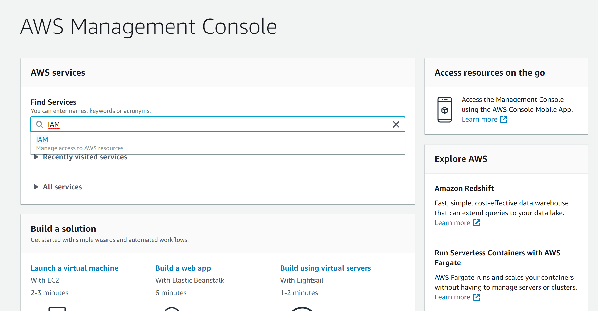
Under "IAM Resources" click on: Users and then "Add user"
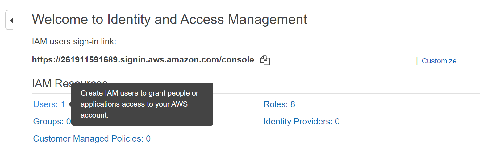
Select "Programmatic access"
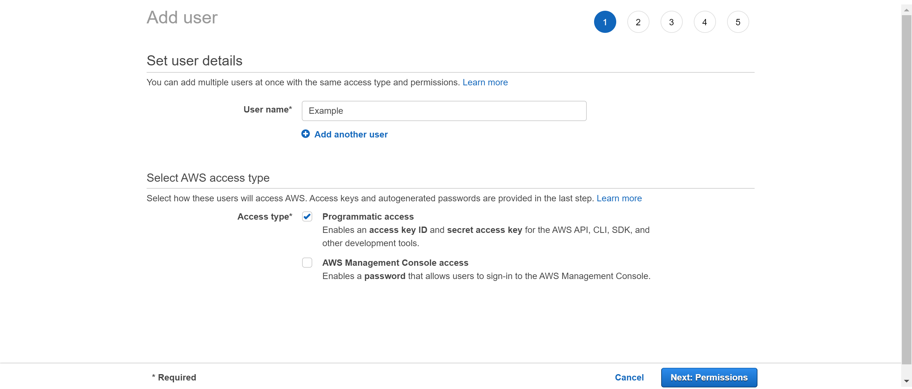
Don't choose any permissions yet; click next
Don't add any tags; click next
Click "Create user"
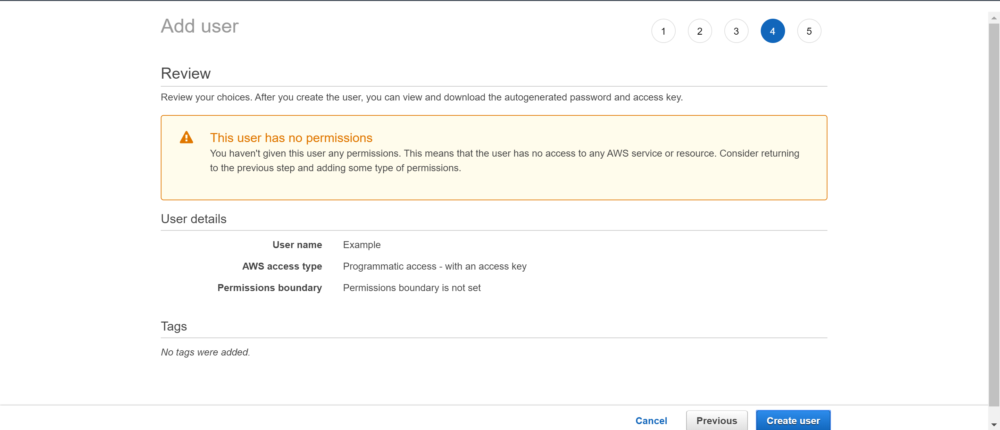
Click on your user's name and then choose "Add inline policy"
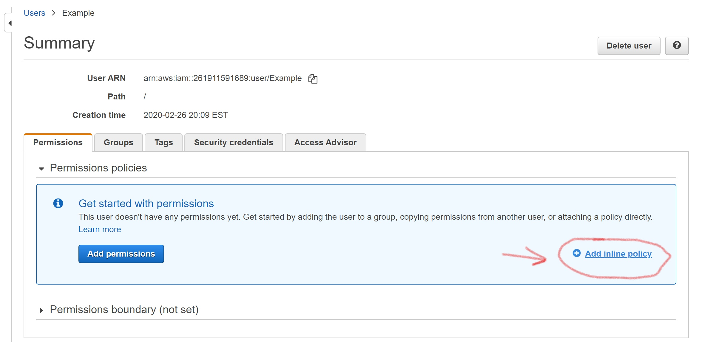
Open the "JSON" tab and copy/paste this into the box:
````
{
    "Version": "2012-10-17",
    "Statement": [
        {
            "Effect": "Allow",
            "Action": [
                "s3:ListAllMyBuckets",
                "s3:PutObject",
                "s3:GetObject"
            ],
            "Resource": [
                "arn:aws:s3:::*"
            ]
        }
    ]
}
````
Before you create your bucket, copy the User ARN, you will need this to link the IAM to your bucket
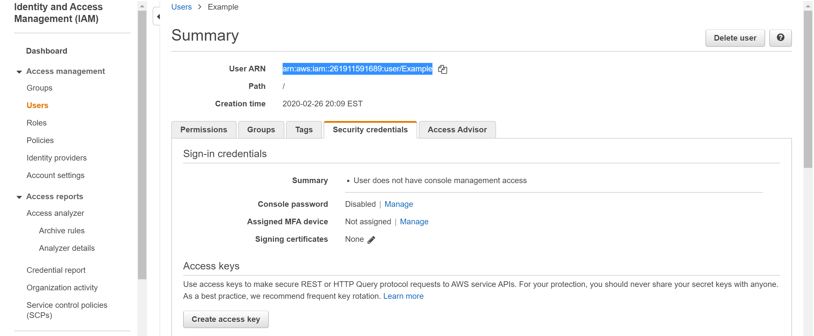

### Creating your bucket
In the navbar at the top of the page, click on "Services", in the searchbar type: "S3"

click on create bucket and give it a unique name and enter the region (I guess pick the one closest to you)
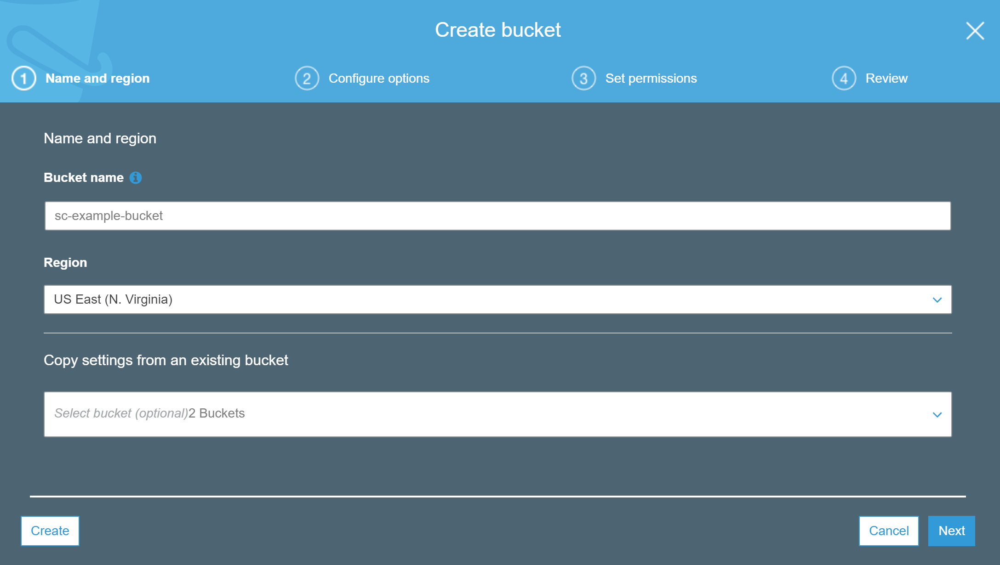
Don't use any configuration options, you do NOT want versioning, it will fill your bucket with thousands of files and take up all your storage space; click next
Do not block public access to your bucket, this app currently relies on the bucket being public.
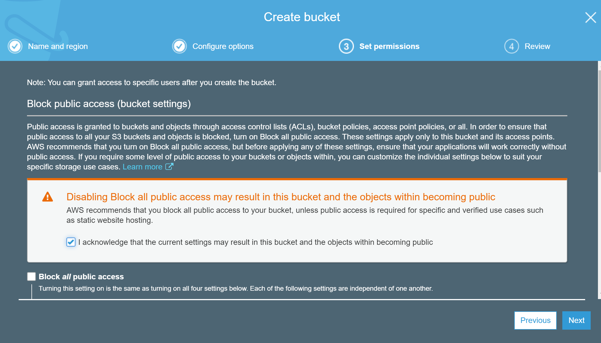
Click on your newly created bucket
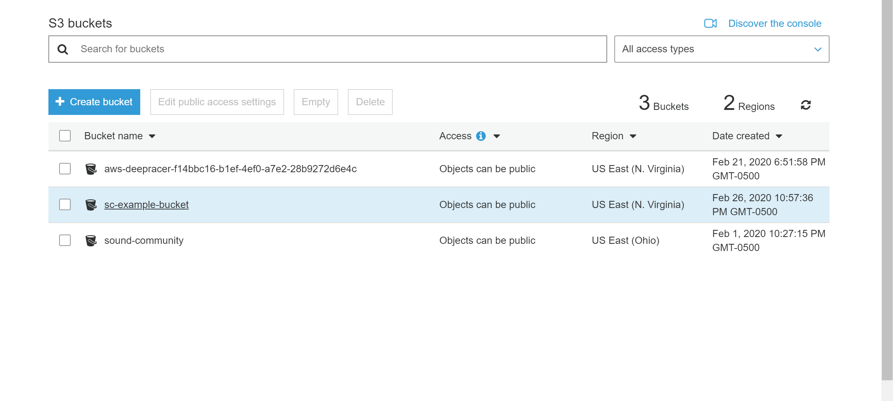
Under the "Bucket policy" tab, copy and paste this:
````
{
    "Version": "2012-10-17",
    "Statement": [
        {
            "Effect": "Allow",
            "Principal": {
                "AWS": "arn:aws:iam::261911591689:user/Example"
            },
            "Action": "s3:ListBucket",
            "Resource": "arn:aws:s3:::sc-example-bucket"
        },
        {
            "Sid": "AddCannedAcl",
            "Effect": "Allow",
            "Principal": {
                "AWS": "arn:aws:iam::261911591689:user/Example"
            },
            "Action": [
                "s3:PutObject",
                "s3:PutObjectAcl"
            ],
            "Resource": "arn:aws:s3:::sc-example-bucket/*",
            "Condition": {
                "StringEquals": {
                    "s3:x-amz-acl": "public-read"
                }
            }
        }
    ]
}
````
but replace arn:aws:iam::261911591689:user/Example with your own User ARN
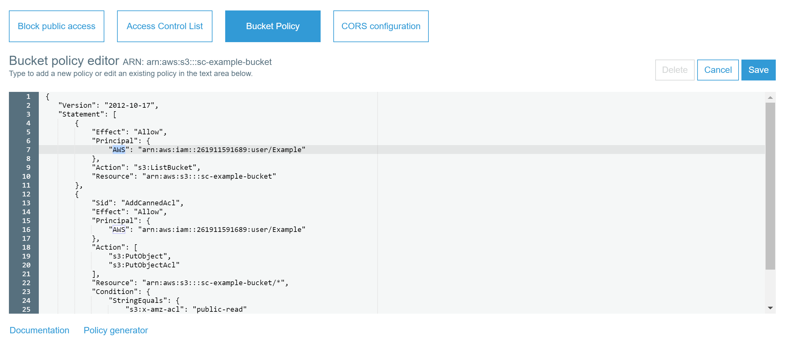
and replace arn:aws:s3:::sc-example-bucket and arn:aws:s3:::sc-example-bucket/* in front of resource with your own ARN at the top of the page.
pay attention to the two resources, the second one has a /* but the first one does not, this is important.
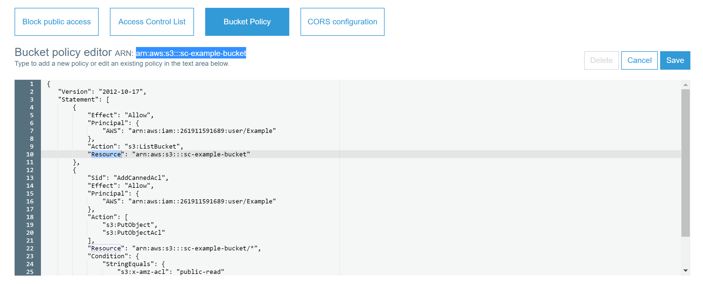
Save and go to the "CORS configuration" tab, copy and paste this into the box
````
<?xml version="1.0" encoding="UTF-8"?>
<CORSConfiguration xmlns="http://s3.amazonaws.com/doc/2006-03-01/">
<CORSRule>
    <AllowedOrigin>*</AllowedOrigin>
    <AllowedMethod>GET</AllowedMethod>
    <AllowedMethod>POST</AllowedMethod>
    <AllowedMethod>PUT</AllowedMethod>
    <MaxAgeSeconds>3000</MaxAgeSeconds>
    <AllowedHeader>Authorization</AllowedHeader>
</CORSRule>
</CORSConfiguration>
````
Save, and that's it. You should be able to upload, search for and play sound files.

### Hooking up bucket

To hook the app up to your s3 bucket, create a .env file in the sound-community repository that looks like this:
(Without the brackets) And here is a list of all the AWS region codes - https://docs.aws.amazon.com/general/latest/gr/rande.html
````
AWSAccessKeyId={IAM user Access key ID}
AWSSecretKey={IAM user Secret key}
Region={bucket region code}
Bucket={bucket name}
````

Dependencies:

Howl js - Plays sound files
Axios - Makes calls to the api

(Currently required jquery to make uploads, am attempting to find an alternative)

